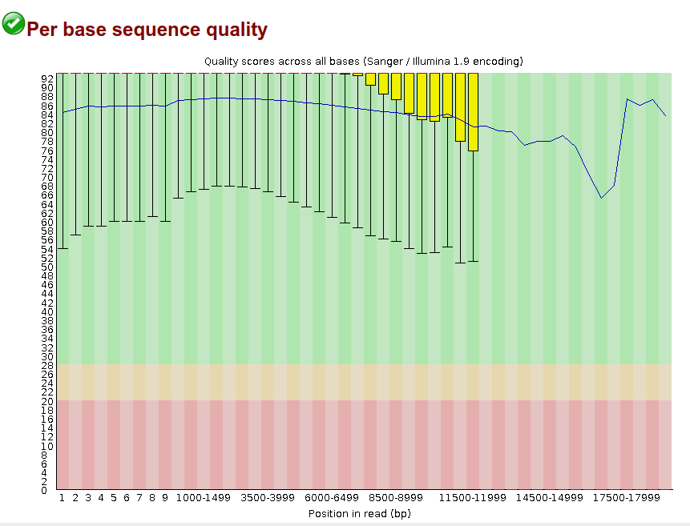
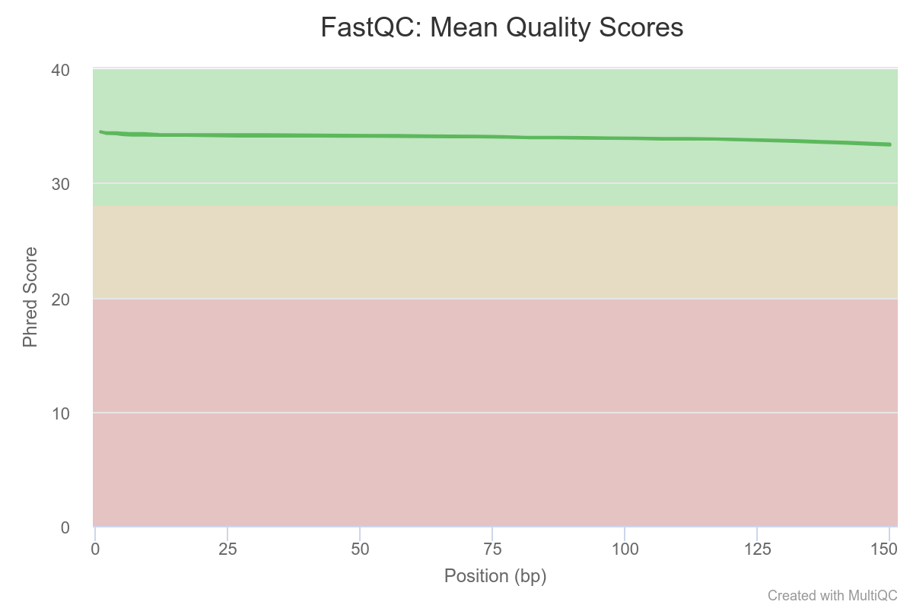
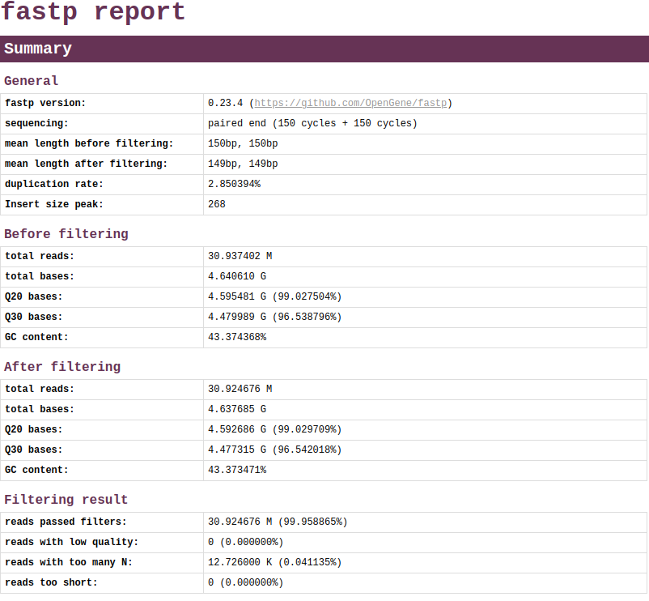
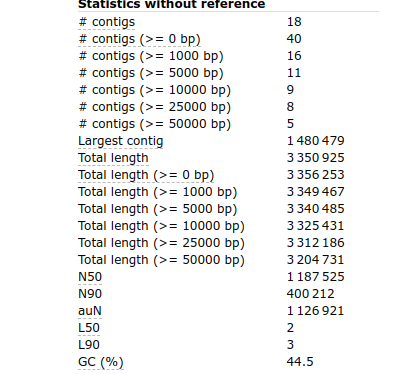
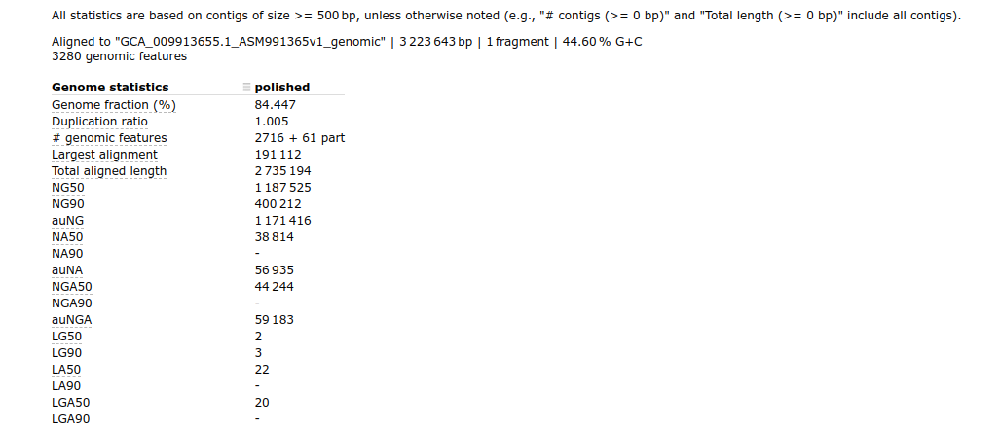

# HTS_2024_Denovo_genome_assembly-

## Introduction
This project demonstrates the de novo genome assembly of the Whole Genome Sequence of [*Lactiplantibacillus plantarum*](https://en.wikipedia.org/wiki/Lactiplantibacillus_plantarum) (formerly *Lactobacillus plantarum*) strain JM015 as part of the course requirement.

De novo genome assembly is the process of constructing a genome sequence from scratch, without the use of a reference genome. This technique is crucial for studying organisms with unknown or highly variable genomes. The goal of this project is to assemble the aforementioned genome using various bioinformatics tools and evaluate the quality of the assembly. For this case, we'll be demonstrating a hybrid assembly approach using short Illumina reads and long PacBio SMRT reads. This approach combines the strengths of short-read sequencing, which offers high accuracy, with long-read sequencing, which provides longer contiguous sequences. These sequences are long enough to span most repeated regions of the genome and help reduce the gaps during assembly.

## Setting up our working environment
> **NOTE!**
> 
> This project was demonstrated on a Linux system

Throughout this project, we'll be making use of a couple of tools which will be installed using [conda](https://conda.io/docs/).

Clone the github repo in your home folder and set up the working directory and data directory
```bash
cd
git clone https://github.com/Bioinformatics-courses/HTS_2024_denovo_genome_assembly-.git
mv HTS_2024_denovo_genome_assembly- denovo
cd denovo
mkdir -p data/{raw,ref}

```

> **CODE BREAKDOWN**
> 
> - **`cd`** - changing to the $HOME directory (if not already there)
> - **`git clone`** - clones the git repo url provided to current directory
> - **`mv HTS_2024_denovo_genome_assembly- denovo`** - renames the cloned dir to "denovo" (this dir is set in the scripts as the main working directory)
> - **`cd denovo`** - takes us to the denovo directory
> - **`mkdir -p data/raw`** - creates data/raw and data/ref where we will keep our fastq raw files and reference genome later, respectively.
> 
Next we create our conda environment from the yml file provided in the env folder and activate the environment
```bash
conda env create -f env/denovo-conda.yml
conda activate denovo

```

## The Data
The datasets used for this assemby process are WGS of Lactiplantibacillus plantarum (formerly Lactobacillus plantarum). Since we are going to be doing hybrid assembly, we are using both short and long reads. The datasets here were sequenced from the same biological sample and consits of :
- A long read PACBIO_SMRT run with accession number [SRR29409521](https://www.ncbi.nlm.nih.gov/sra/SRX24922988[accn])
- Paired-end ILLUMINA short reads with accession number [SRR29409522](https://www.ncbi.nlm.nih.gov/sra/SRX24922987[accn])

They can be sourced from the links provided above, but better still, can be obtained using sra-toolkit
```bash
sudo apt-get install sra-toolkit 
prefetch SRR29409521 SRR29409522 -O data/
fasterq-dump data/SRR29409521 --outdir data/raw
fasterq-dump data/SRR29409522 --outdir data/raw

```
We'll end up with 3 files in the data/raw subdirectory of our working directory, SRR29409521.fastq, SRR29409522_1.fastq and SRR29409522_2.fastq, which are our long read and paired-end short reads respectively.

## Quality check
The first script we're going to run is the quality_check.sh. This script runs fastqc on the fastq files in data/raw and generates a fastqc report. It also aggregates the report of the paired-end read with Multiqc.

```bash
cd scripts
sudo chmod +x quality_check.sh
./quality_checks.sh
```

> **CODE BREAKDOWN**
> 
> - **`cd scripts`** - this moves us into our scripts directory
> - **`sudo chmod +x quality_check.sh`** - grants execute permission to the script
> - **`./quality_checks.sh`** - executes the script
>

Taking a look at our script (properly commented of course), the script sets up the working directories and creates our output directory quality_check_reports/ after which it loops over the files in dir/raw and runs fastqc on them. It also aggregates the fastqc report of the paired-end reads with MultiQC.

Visualizing the output of our long read quality check (denovo/quality_check_report/fastqc_output/SRR29409521_fastqc.html). The report shows overall high per base sequence quality, with median scores above 90 and only a low average dip to 66 towards the end.
<center></center>

Next, we examine the MultiQC report of our paired-end read (denovo/quality_check_report/multiqc_output/multiqc_report.html). We also see overall good reports here with the mean quality score of the forward and reverse reads generally hovering around the 35 mark.
<center></center>

## Quality Control
Before we do proceed to assembly, we have to do some quality control. Our datasets from our quality check do not look to be in need of trimming, or adapter removal. So instead, we're just going to run some basic quality control on our short paired-end reads using the default qc parameters of the tool [fastp](https://github.com/OpenGene/fastp) in our script. It’s easy to use and lives up to its name (very fast).

For our PacBio long read data, we're also going to be running very light QC, using the tool [Filtlong](https://github.com/rrwick/Filtlong) in our script. Filtlong is set in the script to remove any reads shorter than 1 kbp and also exclude the worst 5% of reads. The reason for this light QC is that the data is of high quality, so we just want to filter out the worst of the read. Filtlong prefers longer reads and aggressively filters out shorter ones. This generally benefits genome assembly but can be detrimental for small plasmids, hence why we only choose to exclude reads shorter than 1kpb.

To run the quality_control.sh script, we navigate to our scripts folder, give execute permission to quality_control.sh and run the file.

```bash
cd scripts # assuming we're in our working folder
sudo chmod +x quality_control.sh
./quality_control.sh
```
This will generate 4 outputs for the short reads: 2 paired and 2 unpaired reads for our fastp QC, and a filtered long read file from the Filtlong QC, all located in the corresponding subdirectories under data/QC.
The unpaired reads from the fastpc QC are very small compared to the the paired reads and that is very good. Taking a look below at the fastp report generated, we can see that not much changed.
<center></center>

## Assembly
For the assembly, we'll be running the assembly.sh script in the scripts folder. The primary tool in this script is [Unicycler](https://github.com/rrwick/Unicycler). Unicycler is an assembly pipeline for bacterial genomes and comes highly recommended for hybrid assembly of bacteria.
Unicycler uses [SPAdes] to produce graphs, which are made by performing a de Bruijn graph assembly with a range of different k-mer sizes. After generating a short-read assembly graph, Unicycler then uses the long reads to scaffold the graph to completion. It performs best when the short reads are deep and have even coverage.

The assembly process is pretty straight-forward: Unicycler hybrid assembly is run by passing our paired-end short reads, and our unpaired(if available) and the final secret sauce, the long read, to Unicycler, which is exactly what we have in out script. We run the script using:

```bash
cd scripts # assuming we're in our working folder
sudo chmod +x assembly.sh
./assembly.sh
```

Unicycler takes a long time to run hybrid assembly; with 4 threads given on my i5 5th gen cpu with 8gbs of ram, it took 11 hours to complete the hybrid assembly! The output is stored in assembly_output/ where we have the most important files: assembly.fasta (our assembled genome), assembly.gfa (our assembly graph) and unicycler.log (log file).

## Polishing
Some papers mention polishing a de novo hybrid assembly of a bacterial genome may be necessary, so here we go. We'll be using a tool for this in the script called [Pilon](https://github.com/broadinstitute/pilon/wiki). Pilon requires as input a FASTA( our assembly.fasta) file of the genome along with one or more BAM files of reads aligned to the input FASTA file (we'll be generating the BAM file and aligning using [bwa](https://github.com/lh3/bwa) and [samtools](https://www.htslib.org/)).

Taking a quick peek at our polish.sh script, we can see the major steps involved in the polishing of our assembly. I'll highlight them and break it down.

```bash
cp -i $ASSEMBLY/assembly.fasta $MAP

bwa index $MAP/assembly.fasta

bwa mem -t $THREADS $MAP/assembly.fasta $SHORT1 $SHORT2 | samtools view - -Sb | samtools sort - -@ $THREADS -o $MAP/mapped/mapping.bam

samtools index $MAP/mapped/mapping.bam -@ $THREADS

pilon --genome $MAP/assembly.fasta --frags $MAP/mapped/mapping.bam --fix all --changes --output $POLISH/polished

```

> **CODE BREAKDOWN**
> 
> - **`cp -i $ASSEMBLY/assembly.fasta $MAP`** - this interactively copies our assembly.fasta into another directory. Note that $ASSEMBLY and $MAP are directory variables in the script
> - **`bwa index $MAP/assembly.fasta`** - use bwa to index our assembled genome
> - **`bwa mem -t $THREADS $MAP/assembly.fasta $SHORT1 $SHORT2 | samtools view - -Sb | samtools sort - -@ $THREADS -o $MAP/mapped/mapping.bam`** - this maps the the genome to our short reads, then sends the output to be converted to a BAM file and finally sorts the BAM file
> - **`samtools index $MAP/mapped/mapping.bam -@ $THREADS`** - index the sorted BAM file with sam tools
> - **`pilon --genome $MAP/assembly.fasta --frags $MAP/mapped/mapping.bam --fix all --changes --output $POLISH/polished`** - finally we call pilon to do the genome polishing
>   - **`--genome`** - specifies the genome file to be polished
>   - **`--frags`** -  specifies our BAM file aligned to the genome
>   - **`--fix all`** - specifies categories to fix, in this case all (snps, bases, indels, ...)
>   - **`--changes`** - creates a file detailing all the changes in the output file
>   - **`--output`** - specifies prefix for the output files

The output file, polished.fasta can be found in "denovo/polishing"

## Visualization
[Bandage](https://rrwick.github.io/Bandage/) is a good program for visualizing de novo assembly graphs. It's what we're using in the next script that we'll run, visualize.sh. This script simply calls Bandage and pass our assembly.gfa as a parameter and adds the option to show the contig lengths in the image. Let's take a look at the main part of the script.

```bash
Bandage image $GRAPH_FILE $IMAGE_OUT --lengths
```
> **CODE BREAKDOWN**
>
> - **`Bandage`** - calls the Bandage program
>   - **`image`** -  generate an image file of a graph
>   - **`$GRAPH_FILE`** - variable for the path to the assembly graph
>   - **`$IMAGE_OUT`** - output path "denovo/bandage_output"
>   - **`lengths`** - this option adds the contig lenghts as labels to the image
>  

As usual, we'll run the script by:
```bash
cd scripts # assuming we're in our working folder
sudo chmod +x visualize_assembly.sh
./visualize_assembly.sh
```

The script can be adjusted as needed and options changed for specific visualization output.

## Evaluation
Finally, we get to to evaluate the the quality of our assembly. For this we'll be running the script, quast.sh. The primary program in this script is [Quast](https://github.com/ablab/quast), a genome assembly evaluation tool. From the Quast README, "The QUAST package works both with and without reference genomes. However, it is much more informative if at least a close reference genome is provided along with the assemblies". Given that the reason we do denovo assembly is usually because there is no reference genome, we don't necessarily need it for evaluation, but having a close reference helps to benchmark our assembly quality, so we'll be using one. It is also particularly useful that in the Quast report, there is also info on the assembly without comparison to the reference.

We can get the reference genome of *Lactiplantibacillus plantarum* from [NCBI](https://www.ncbi.nlm.nih.gov/datasets/genome/GCF_009913655.1/). Simply follow the link, download the fasta sequence and gff file, then copy to the working folder subdirectory "data/ref".

We can also grab them using this code below
```bash
cd ~/denovo/data/ref
wget -nc https://ftp.ncbi.nlm.nih.gov/genomes/all/GCF/009/913/655/GCF_009913655.1_ASM991365v1/GCF_009913655.1_ASM991365v1_genomic.fna.gz
wget -nc https://ftp.ncbi.nlm.nih.gov/genomes/all/GCF/009/913/655/GCF_009913655.1_ASM991365v1/GCF_009913655.1_ASM991365v1_genomic.gff.gz
```
Let's breakdown the main part of the script we'll be using "quast.sh"
```bash
quast $PILON_POLISHED_FILE -r $REFERENCE_GENOME -g $GFF_FILE -o $EVALUATION_OUT/ --threads $THREADS
```
> **CODE BREAKDOWN**
>
> - **`quast`** - calls the quast tool
>   - **`$PILON_POLISHED_FILE`** -  path to our polished assembly file
>   - **`$-r`** -  Reference genome file
>   - **`-g`** - File with genomic feature coordinates in the reference
>   - **`-o`** - Directory to store all result files
>   - **`--threads`** - number of threads to be used

As usual we make the script executable and run it.

Lets take a view at the results stored in "denovo/evaluation_output"

<h5>This is our basic statistics without reference</h5>
<center></center>

<h5>This is stats with reference genome</h5>
<center></center>


## Discussion of Results
From the evaluation results above, we can observe some key metrics such as GC content, N50, L50, total length, and more. These will inform us of our assembly quality.

The total length of the assembly is approximately 3.35 Mb. This falls within the range of 2.94 to 3.90 Mb observed across multiple L. plantarum strains. Specifically, strains have a mean genome size of around 3.32 Mb, which closely matches the 3.35 Mb we have in the assembly evaluation report.

Next, we look at the GC content assembly, 44.5%, which is consistent with the range of 44.1% to 46.5% reported for this species. The typical GC content is around 44.2%, with that of our reference genome at 44.6% which is a good sign, and is indicative of a good assembly.

Looking at the contig number and lengths, there 18 contigs with sizes larger than 1,000 bp. This number of contigs and the observed largest contig size (approximately 1.48 Mb) indicate a reasonably well-assembled genome, but not the best. 18 contigs still indicates fragmentation(possibly due to low coverage of the long reads used in scaffolding?), where even lower contigs would be better. But overall, a large contig size as we see here is indicative of good contiguity.

The N50 value, which represents the length of the shortest contig at 50% of the total genome length is 1,187,525 bp and also, combined with the L50 of 2 suggest a good quality assembly with a good representation of large contigs: this tells us that two contigs account for half of the total assembly length, highlighting a concentration of sequence data in a few long contigs.

Finally, observing our statisitc with reference, we can see that 84.447% of the genome was assembled in respect to the reference genome. We also see good quality indicated by the absence of ambiguous bases (N's) and a low duplication ratio (1.005). This is overall quite decent, but could be better where we can hope to get higher genomic assembly fraction.

However, as shown in the reference statistic reports, there are a couple of misassemblies as well as indels and mismatches, which are significant. There are also about 615 kbp of the assembled genome that remained unaligned with the reference genome, reflecting potential strain-specific sequences or assembly artifacts. It is important to note that the reference genome used for evaluation belongs to a different strain of *Lactiplantibacillus plantarum*. This strain difference likely accounts for some of the observed structural variations, unaligned regions, and genetic polymorphisms. Further assemblies with different tools and methods may give us more information to make a conclusive stand.


## Challenges
One of the major challenges faced in this project was computational complexity with many of the processes especially the hybrid assembly process taking hours! The lack of proper high performance computing access limited the scope of this project, where a better hybrid assembly result would have benefitted from multiple assembly runs using different tools and a final comparison evaluation made to pick out the best result.

Also, interpretation of some metrics and appropriate choice of parameters to be used during some of these processes to optimize results were difficult, as the expertise was lacking on our end.


## Conclusion and Future Directions
The de novo assembly of *Lactiplantibacillus plantarum* using hybrid assembly approach produced good results as seen from the GC content and N50 and other metrics, and provides a solid foundation for further genetic and functional studies. While the assembly is highly contiguous, the presence of structural variations, misassemblies and unaligned regions necessitates further analysis and validation. Reassembling the genome using different tools like [MEGAHIT](https://github.com/voutcn/megahit) and different/more stringent paramaters might produce better results on evaluation.

For this particular assembly, further polishing and error correction using tools like Pilon or Racon, to reduce the number of sequencing errors and refine the assembly quality may benefit the assembly. Further analysis of the unaligned regions should be done to determine whether they contain novel genes, plasmids, or other genomic elements as these regions could be of particular interest for understanding the unique capabilities of the assembled strain.


